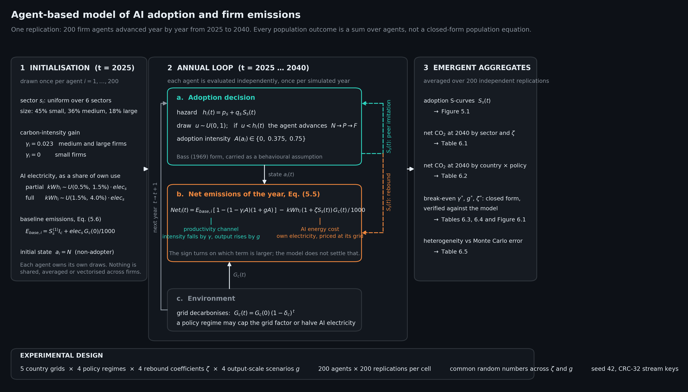
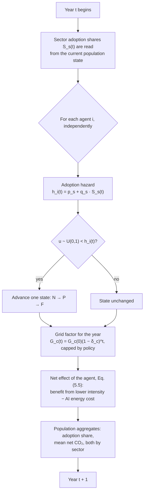

# Model description (ODD protocol)

This document describes the simulation in the structure of the ODD protocol
(Overview, Design concepts, Details; Grimm et al., 2006, 2020), so that the model
can be read and re-implemented without reading the source. Symbols follow the
thesis; equation numbers refer to it.



---

## 1. Purpose

To evaluate the sign of the net operational-carbon effect of AI adoption at the
firm level, under stated assumptions, and to locate the point at which that sign
reverses.

The model is not a forecast and not a causal estimate. No parameter is identified
at the level of the outcome it produces. Its purpose is to put two separately
estimated literatures — an AI-induced fall in carbon intensity, and an AI-induced
rise in labour productivity — into a single unit of account, and then to ask how
far each assumption can move before the conclusion changes. Section 5.1 of the
thesis states this restriction; the break-even analysis of Section 6.2 is the part
that carries the argument.

---

## 2. Entities, state variables and scales

**Agents.** One entity type: the firm (`Firm` in `src/model.py`). A firm holds

| Variable | Meaning | Set at |
| --- | --- | --- |
| `sector` | one of six sectors | initialisation, fixed |
| `size` | small / medium / large | initialisation, fixed |
| `gamma` | its own carbon-intensity reduction, `0.023` or `0` | initialisation, fixed |
| `kwh_p`, `kwh_f` | its AI electricity demand as a partial and as a full adopter | initialisation, fixed |
| `e_base` | its baseline emissions, Scope 1 + Scope 2, Eq. (5.6) | initialisation, fixed |
| `state` | adoption state `a_i ∈ {N, P, F}` | updated annually |

**Collectives.** Firms belong to a sector. The sector is not an agent: it is the
grouping over which the adoption share `S_s(t)` is computed, and the only channel
through which one firm's decision reaches another.

**Environment.** One national grid per population, with carbon intensity `G_c(t)`
in kgCO₂e/kWh, decarbonising at a country-specific annual rate `δ_c`. A policy
regime may cap the grid factor, halve AI electricity demand, or both.

**Scales.** One time step is one year; the horizon is 2025 to 2040 (16 steps).
Space is not represented. One population is 200 agents, and one cell of the
experimental design is 200 independent replications of that population.

---

## 3. Process overview and scheduling

Each year, in this order:



Two scheduling details matter for reading the output:

- **Shares are read once per year, before any agent moves.** Every agent in year
  `t` faces the hazard implied by the state of its sector at the end of year
  `t − 1`, so within-year ordering of agents does not affect the result.
- **The grid factor of the year is applied after adoption.** A firm that adopts in
  year `t` pays for its AI electricity at the year-`t` grid factor.

---

## 4. Design concepts

**Emergence.** The adoption S-curves, the aggregate energy path and the net carbon
balance are outcomes of the loop over agents. None of them is written down as a
population equation. Changing the agent rule changes them; there is no aggregate
expression to keep consistent by hand.

**Adaptation and objectives.** Deliberately minimal. Firms do not optimise, do not
compare costs against benefits, and do not respond to the grid or to electricity
prices. Adoption is a stochastic transition whose rate depends on peers, not a
decision. This is a restriction of the model and is listed as such in Section 6.4:
the model cannot represent a firm that adopts *because* the grid is clean.

**Sensing and interaction.** An agent senses exactly one thing outside itself: the
adoption share of its own sector. There is no network, no space and no direct
firm-to-firm interaction.

**Stochasticity.** Three sources: the sector and size draws at initialisation, the
AI electricity draws at initialisation, and the annual adoption draw. All are
seeded (see §7).

**Collectives.** Sectors, as described above.

**Observation.** At the end of each year the population records the adoption share
overall and by sector, and the mean net effect overall and by sector. Cell-level
output is the mean over replications, with the 2.5th and 97.5th percentiles of the
replication means reported as the Monte Carlo interval — an interval on the
simulation's own average, not a confidence interval for European firms.

---

## 5. Initialisation

At `t = 2025` every agent is a non-adopter. Each draws, independently:

- a sector, uniformly over the six sectors;
- a size, from the EIBIS distribution (45% small, 36% medium, 18% large);
- `gamma = 0.023` if medium or large, `0` if small — the published effect is
  concentrated in larger firms, and an insignificant coefficient enters at its
  point estimate of zero rather than as a manufactured distribution;
- AI electricity demand as a share of its own sector's electricity use:
  `U(0.5%, 1.5%)` as a partial adopter and `U(1.5%, 4.0%)` as a full adopter;
- baseline emissions `E_base,i = S⁽¹⁾_s · I_c + elec_s · G_c(0)/1000`, i.e. the
  sector's Scope 1 per firm scaled to the country, plus Scope 2 constructed from
  the firm's own electricity priced at its own grid.

Scope 2 is constructed rather than stored, so a firm on a coal grid carries the
Scope 2 burden of that grid on both sides of Eq. (5.5).

---

## 6. Input data

No external data is read at run time. Every parameter is a module constant in
`src/model.py`, and each is traced to a source in [`parameters.md`](parameters.md) and in
Table 5.2 of the thesis, grouped by identification status:

| Group | Content |
| --- | --- |
| A. Measured | grid intensities and decarbonisation rates (Ember/OWID); Scope 1 and electricity per firm (Eurostat) |
| B. Measured | firm-size distribution (EIBIS) |
| C. Transferred | `γ = 0.023` (Zhou & Bu 2026, Chinese listed firms); rebound range (Sorrell et al. 2009); national Scope 1 scaling |
| D. Calibrated | AI electricity share (IEA 2025); adoption intensity (McKinsey 2025); Bass coefficients, set ordinally to the EIBIS gradient |
| E. Scenario | output-scale response `g`, swept over `{0, 0.01, 0.02, 0.04}` and not estimated at all |

The order of that table is the order in which the results should be doubted.

---

## 7. Submodels

### 7.1 Adoption hazard

```
h_i(t) = p_s + q_s · S_s(t)
```

`p_s` is the innovation coefficient and `q_s` the imitation coefficient of the
firm's sector; `S_s(t)` is the share of that sector already in state P or F. The
form is Bass (1969), used as a behavioural assumption — firms are more likely to
adopt when more of their sector peers already have — and not as an empirical law.
Sector *ranking* is calibrated to the EIBIS adoption gradient; the timing and shape
of each curve are consequences of the assumption, not evidence for it.

Under the combined-policy regime, every firm adopts on the coefficients of the
fastest sector actually observed (ICT), rather than on a free parameter.

### 7.2 Adoption intensity

`A(N) = 0`, `A(P) = 0.375`, `A(F) = 0.75` — three and six of the eight business
functions of McKinsey's *State of AI* (2025).

### 7.3 Net effect, Eq. (5.5)

```
Net_i(t) = E_base,i · [1 − (1 − γ_i A)(1 + g A)]  −  kWh_i · (1 + ζ S_s(t)) · G_c(t) / 1000
```

The first term is the productivity channel: adoption lowers carbon intensity by
`γ` and may raise output by `g`, and the two proportional changes multiply. The
expression is kept exact, so it retains the interaction term `γ g A²` that a
first-order expansion drops. The second term is the AI energy cost: the firm's own
AI electricity, raised by the rebound multiplier and priced at its grid.

The sign of `Net_i(t)` is set by which term is larger, and the model does not
settle that question. `g` is the pass-through from productivity to output, and no
study measures it.

### 7.4 Grid path

```
G_c(t) = G_c(0) · (1 − δ_c)^t
```

A policy ceiling acts as a *minimum* against this path: a mandate can only clean a
grid, never dirty one. Without that guard, the renewable mandate would *raise*
emissions on grids already cleaner than the floor.

### 7.5 Rebound

`ζ` scales AI electricity demand with the adoption share of the firm's own sector,
`(1 + ζ S_s(t))`, and is swept over `{0, 0.10, 0.20, 0.30}`. `ζ = 0` reproduces the
base model exactly (enforced by a test). No AI-specific rebound estimate exists, so
Table 6.3 reports the `ζ*` at which the net effect vanishes instead of asserting a
value.

### 7.6 Break-even solving

Eq. (5.5) is linear in `γ`, in `g`, in `ζ` and in the emissions scale `E_base`, so
each break-even value is solved in closed form from the simulated components rather
than by numerical search. Every solution is then verified by re-running the
unmodified model at the solved value and confirming that the mean net effect at
2040 returns to zero to within 10⁻⁴ tCO₂/yr.

---

## 8. Determinism

Each replication is seeded with `zlib.crc32` of a fixed key rather than Python's
`hash()`, which is salted per process. Runs therefore reproduce byte for byte
regardless of `PYTHONHASHSEED`.

Across a sweep of `ζ` or `g`, the parameter is deliberately kept out of the seed:
every value runs on the identical population and the identical adoption path, so
the difference between two cells is the parameter, not a newly drawn population.
That is what makes the monotonicity of the sweeps hold by construction rather than
up to sampling noise.

---

## 9. What the model cannot do

Listed in full in Section 6.4 of the thesis. In short: operational carbon only
(embodied emissions from hardware and data-centre construction are excluded, so
every net benefit here is an upper bound); Scope 3 excluded on both sides; Scope 2
modelled from sector averages rather than observed at the firm; `γ` transferred
from Chinese listed firms; data-centre siting not modelled; water and land
excluded; and adoption that responds neither to the grid nor to prices.

---

### References for the protocol

Grimm, V. et al. (2006). A standard protocol for describing individual-based and
agent-based models. *Ecological Modelling* 198(1–2), 115–126.

Grimm, V. et al. (2020). The ODD protocol for describing agent-based and other
simulation models: a second update. *JASSS* 23(2), 7.
